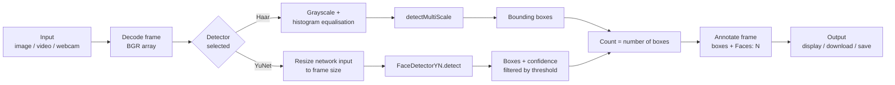

# Face Detection and Counting Using OpenCV

> Computer Vision — Final Project
> **Author:** [YOUR NAME] · **Course:** [COURSE NAME] · **Instructor:** [INSTRUCTOR NAME]
> **GitHub:** https://github.com/[USERNAME]/face-counter
> **Live demo:** [LIVE URL]  *(or)*  **Demo video:** [VIDEO LINK]

---

## Table of Contents
1. [Project Overview and Objectives](#1-project-overview-and-objectives)
2. [Features and Technologies Used](#2-features-and-technologies-used)
3. [Installation and Setup](#3-installation-and-setup)
4. [Usage and Screenshots](#4-usage-and-screenshots)
5. [System Workflow / Architecture](#5-system-workflow--architecture)
6. [Testing and Results](#6-testing-and-results)
7. [Challenges and Future Improvements](#7-challenges-and-future-improvements)
8. [Conclusion](#8-conclusion)
9. [References](#9-references)

---

## 1. Project Overview and Objectives

Counting people in a photo or video is useful for attendance tracking, event monitoring, retail footfall analysis, and classroom or office occupancy estimation. Doing it by hand is slow and error-prone.

This project is a computer-vision application that **detects human faces in images, video files, and live webcam streams, and reports how many faces are present**. It implements two detection approaches so they can be compared directly: the classic **Haar Cascade** (Viola–Jones) and a modern deep-learning detector, **YuNet**, both running through OpenCV.

### Objectives
- Detect faces in still images, recorded videos, and live webcam input.
- Count the detected faces and display the count on the output.
- Compare a classical method (Haar Cascade) with a deep-learning method (YuNet) on accuracy and speed.
- Provide a simple web interface so anyone can try the system without writing code.
- Evaluate the system on varied test images (lighting, pose, group size) and document its strengths and limits.

### Scope
The system detects **faces**, not identities. It does not recognise or store who a person is, and uploaded files are processed in memory or in temporary files only.

---

## 2. Features and Technologies Used

### Features
- **Face detection and counting** in images, videos, and webcam streams.
- **Two selectable detectors:** YuNet (DNN) and Haar Cascade.
- **Adjustable sensitivity:** confidence threshold (YuNet) and `minNeighbors` (Haar).
- **Annotated output:** bounding boxes plus a "Faces: N" banner; optional confidence scores.
- **Video analytics:** average faces per frame, maximum faces in a frame, processing FPS, and a faces-per-frame chart.
- **Downloadable results:** annotated image (PNG) and annotated video (MP4).
- **Command-line tool** for batch and webcam use.
- **Evaluation script** that compares both detectors against hand-counted ground truth.
- **Unit tests** for the core logic.

### Technologies

| Purpose | Technology |
|---|---|
| Language | Python 3.9+ |
| Computer vision | OpenCV (`cv2`) — Haar cascade, `FaceDetectorYN` (YuNet) |
| Numerical processing | NumPy |
| Web interface | Streamlit |
| Testing | pytest |
| Version control / hosting | Git, GitHub, Streamlit Community Cloud *(or Hugging Face Spaces)* |

### Project structure
```
face-counter/
├── app.py               # Streamlit web application
├── main.py              # Command-line interface (image / video / webcam)
├── detector.py          # Detectors, counting, drawing, video processing
├── evaluate.py          # Compares detectors against ground-truth counts
├── requirements.txt
├── models/              # YuNet ONNX model (auto-downloaded on first run)
├── samples/             # Test images + ground_truth.csv
├── screenshots/         # Images used in this README
├── tests/
│   └── test_detector.py
└── README.md
```

---

## 3. Installation and Setup

### Prerequisites
- Python 3.9 or newer
- `pip` and (recommended) `venv`
- A webcam (optional, for live mode)
- Internet access on first run (to download the ~230 KB YuNet model)

### Steps

```bash
# 1. Clone the repository
git clone https://github.com/[USERNAME]/face-counter.git
cd face-counter

# 2. Create and activate a virtual environment
python -m venv venv
source venv/bin/activate          # Windows: venv\Scripts\activate

# 3. Install dependencies
pip install -r requirements.txt
```

The YuNet model downloads automatically the first time it is used. If you are offline, download
`face_detection_yunet_2023mar.onnx` from the
[OpenCV Zoo](https://github.com/opencv/opencv_zoo/tree/main/models/face_detection_yunet)
and place it in the `models/` folder.

> **Note for local webcam use:** if you want live windows (`cv2.imshow`), install `opencv-python`
> instead of `opencv-python-headless`:
> `pip uninstall opencv-python-headless && pip install opencv-python`

---

## 4. Usage and Screenshots

### 4.1 Web application
```bash
streamlit run app.py
```
Open the address shown in the terminal (normally `http://localhost:8501`), choose a detector in the
sidebar, then upload an image or video.

### 4.2 Command line
```bash
# Image
python main.py --source samples/group.jpg --output results/group_out.jpg

# Video file
python main.py --source samples/clip.mp4 --output results/clip_out.mp4

# Live webcam (press q to quit)
python main.py --source 0 --detector haar

# Options
python main.py --help
```

### 4.3 Run the evaluation
```bash
python evaluate.py
```

### 4.4 Screenshots

| Web app — image mode | Detection with count banner |
|---|---|
|  |  |

| Video analytics | Haar vs YuNet comparison |
|---|---|
|  |  |

*(Replace these with your own screenshots in the `screenshots/` folder.)*

---

## 5. System Workflow / Architecture



### Component overview

| Module | Responsibility |
|---|---|
| `detector.py` | `HaarFaceDetector` and `YuNetFaceDetector` (common `detect()` interface), `annotate()`, `process_video()` |
| `app.py` | Streamlit UI: file upload, sidebar settings, metrics, charts, downloads |
| `main.py` | CLI for images, video files, and webcam |
| `evaluate.py` | Runs both detectors on `samples/` and compares counts with `ground_truth.csv` |

### Detection methods

- **Haar Cascade (Viola–Jones):** slides windows of many sizes over a grayscale image and uses a cascade of simple rectangular features (trained with AdaBoost) to reject non-face regions quickly. Very fast on a CPU, but sensitive to pose, lighting, and occlusion. The `minNeighbors` parameter controls how many overlapping detections are needed to keep a face.
- **YuNet:** a lightweight convolutional neural network trained for face detection. It outputs a bounding box, five facial landmarks, and a confidence score for each face, so a threshold can remove weak detections. It copes much better with rotated, small, and partly hidden faces.

### Counting logic
The face count for a frame is the number of bounding boxes that survive the detector's filtering (`minNeighbors` for Haar, confidence threshold plus non-maximum suppression for YuNet). For video, the count is computed per processed frame, then summarised (average, maximum, per-frame chart).

---

## 6. Testing and Results

### 6.1 Test methodology
- **Test set:** [N] images collected/taken by the author, covering: well-lit single face, small groups, large groups, side profiles, low light, faces with glasses/masks/hats, and images with **no** faces.
- **Ground truth:** faces were counted by hand and stored in `samples/ground_truth.csv`.
- **Metrics:** exact-count accuracy (detected count = true count), mean absolute count error, and average inference time per image.
- **How to reproduce:** `python evaluate.py` (writes `results/results.csv` and prints these tables).

> **Important:** the tables below must be filled in with the output of your own run of `evaluate.py`. Do not submit placeholder numbers.

### 6.2 Per-image results
*(paste the first table printed by `evaluate.py`)*

| Image | Condition | True | Haar | YuNet |
|---|---|---:|---:|---:|
| [image1.jpg] | [well lit] | [ ] | [ ] | [ ] |
| [image2.jpg] | [low light] | [ ] | [ ] | [ ] |
| [image3.jpg] | [side profile] | [ ] | [ ] | [ ] |

### 6.3 Summary
*(paste the second table printed by `evaluate.py`)*

| Metric | Haar Cascade | YuNet (DNN) |
|---|---:|---:|
| Exact-count accuracy | [ ] | [ ] |
| Mean absolute count error | [ ] | [ ] |
| Avg. time per image (ms) | [ ] | [ ] |

### 6.4 Video testing
| Video | Duration | Detector | Avg faces / frame | Max faces | Speed (FPS) |
|---|---|---|---:|---:|---:|
| [clip.mp4] | [ ] | YuNet | [ ] | [ ] | [ ] |
| [clip.mp4] | [ ] | Haar | [ ] | [ ] | [ ] |

### 6.5 Discussion of results
*(Write 3–5 sentences using your real numbers. Suggested points: which detector was more accurate and by how much; which was faster; which conditions caused the most errors; whether errors were misses (undercounting) or false positives (overcounting).)*

### 6.6 Unit tests
```bash
pytest
```
The tests cover result counting, annotation (input image is not modified), image resizing, detector selection, and the "no faces in a blank image" case.

> Exact-count accuracy measures whether the *total* is right; it does not prove each box is on the correct face. For a stricter evaluation, use a labelled benchmark such as WIDER FACE and compute precision/recall with an IoU threshold.

---

## 7. Challenges and Future Improvements

### Challenges
- **False positives with Haar cascades:** textured backgrounds and patterns were sometimes detected as faces; raising `minNeighbors` reduced this but caused more missed faces.
- **Pose and occlusion:** side profiles, masks, hands, and hats reduce detection reliability, especially for Haar.
- **Small faces in crowds:** faces only a few pixels wide are easily missed at normal resolution.
- **Lighting:** very dark or backlit faces lower confidence; histogram equalisation helped the Haar detector.
- **Speed vs accuracy trade-off:** the faster method was less accurate; large images were downscaled to keep processing responsive.
- **Deployment limits:** cloud hosts have no access to a local webcam, so the hosted version supports upload only; live webcam mode runs locally through the CLI.
- **Video double counting:** the per-frame count is not the number of *unique* people in a video, because the same person appears in many frames.

### Future improvements
- **Tracking across frames** (e.g., centroid tracking, SORT/DeepSORT) to count *unique* people in a video.
- **Real-time browser webcam** using `streamlit-webrtc`.
- **Larger-scale evaluation** on WIDER FACE with precision, recall, and mAP.
- **Crowd-counting models** (density-map based) for very dense scenes.
- **Extra detectors** (e.g., MediaPipe, RetinaFace, YOLO-face) added behind the same `detect()` interface.
- **Additional analytics:** heat maps, counts over time exported to CSV, and alerts when a count passes a threshold.
- **Privacy options:** automatic blurring of detected faces.

---

## 8. Conclusion

This project built a working face detection and counting system with OpenCV that handles images, videos, and live webcam input through a web app and a command-line tool. Comparing a classical Haar cascade with the deep-learning YuNet detector showed the trade-off between speed and robustness; [summarise your own finding, e.g. "YuNet was more accurate on angled and low-light faces, while Haar was faster on frontal, well-lit images"]. The modular design (a common `detect()` interface) makes it easy to add new detectors, and the evaluation script makes results reproducible. The main limitations are undercounting in crowds and the lack of identity tracking in video, which are the natural next steps.

---

## 9. References

1. Bradski, G. (2000). *The OpenCV Library.* Dr. Dobb's Journal of Software Tools.
2. OpenCV Documentation — Face Detection using Haar Cascades and `FaceDetectorYN`. https://docs.opencv.org
3. Viola, P., & Jones, M. (2001). *Rapid Object Detection using a Boosted Cascade of Simple Features.* Proceedings of IEEE CVPR.
4. Wu, W., Peng, H., & Yu, S. (2023). *YuNet: A Tiny Millisecond-level Face Detector.* Machine Intelligence Research.
5. OpenCV Zoo — YuNet face detection model. https://github.com/opencv/opencv_zoo/tree/main/models/face_detection_yunet
6. Yang, S., Luo, P., Loy, C. C., & Tang, X. (2016). *WIDER FACE: A Face Detection Benchmark.* IEEE CVPR.
7. Streamlit Documentation. https://docs.streamlit.io
8. NumPy Documentation. https://numpy.org/doc/

---

## License
MIT License — free to use for educational purposes. Add a `LICENSE` file if you want to publish under MIT.
